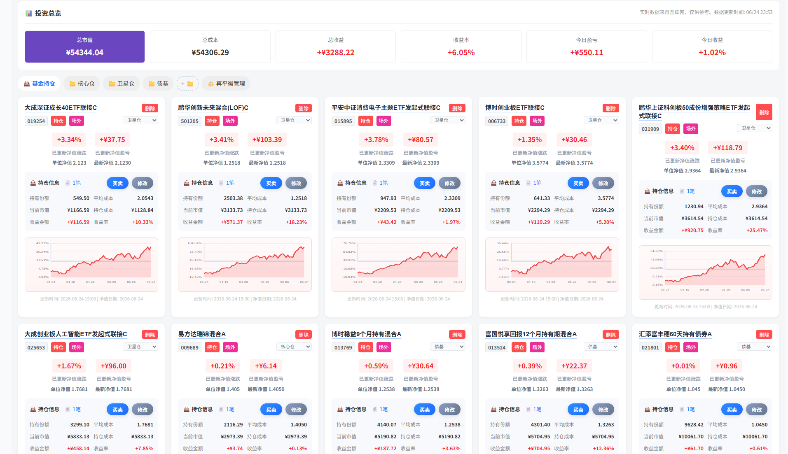

# GoFundBot

[](https://opensource.org/licenses/MIT) []() []()

GoFundBot 是一个基于 Python (Flask) 和 Vue 3 构建的智能基金分析与可视化工具。它不仅提供实时的基金数据查询和可视化图表，还集成了先进的 AI 大模型（LLM），为用户提供深度的基金投资分析、风险评估及市场研判报告。

## 🚀 功能特性

### 🤖 AI 智能投顾
*   **深度基金分析**：基于 LLM 生成专业的基金诊断报告，涵盖业绩归因、风险特征、经理风格及后市策略。
*   **智能仪表盘**：通过 AI 对基金的业绩、管理能力、持仓及市场前景进行多维度打分。
*   **市场情绪摘要**：每日自动生成市场行情摘要，捕捉关键市场动态与板块机会。

### 📊 全面数据可视化
*   **基金详情页**：
    *   **基本信息**：实时净值、估算涨幅、费率结构等。
    *   **业绩走势**：多周期业绩趋势图，支持同类对比。
    *   **资产配置**：股票/债券/现金占比分析。
    *   **持仓透视**：前十大重仓股及其占比变化。
    *   **能力雷达**：直观展示基金的盈利能力、抗风险能力等 5 维指标。
*   **市场概览**：
    *   **全球行情**：上证、深证、纳指、恒生等主要指数实时行情。
    *   **贵金属追踪**：黄金、白银等大宗商品的历史走势与实时数据。

### 🛠 便捷工具
*   **基金搜索**：支持代码/名称快速搜索（本地缓存优化）。
*   **自选管理**：一键添加/移除自选基金，随时跟踪关注标的。
*   **一键部署**：提供 Windows 一键启动脚本，开箱即用。

### 📊 使用方法

#### （1）市场大盘页面

- 市场指数实时走势：展示了上证指数、深证成指、沪深300指数的当日走势。
- 全球行情板块：展示A股、港股、美股重要指数的走势。
- 近7日A股成交量：展示近7个交易日A股的成交量情况。
- 实时贵金属价格：展示黄金9999、现货黄金、现货白银的实时价格及走势。
-  7×24 快讯（右侧边栏）：展示实时重要新闻及其影响行业。
- 行业板块排行（右侧边栏）：展示当日强势板块和弱势板块、主力资金流动情况。


#### （2）基金详情页面

- 搜索基金代码或名称，可以显示基金的详细信息，辅助挑选基金。
- 左侧自选栏：可以将持有的基金添加自选，实时查询估值情况。
- 业绩走势：包含本基金的历史走势、与同类基金和沪深300指数的收益对比、最大回撤及修复情况。
- 同类排名走势：包含选定基金在同类基金中的收益排名情况。
- 资产配置、持有人结构、基金规模变动、申购赎回情况：反应基金持仓的变化与热门度。
- 基金经理能力评估：调用东方财富API，绘制经理能力雷达图。
- 同类基金涨幅榜：辅助挑选同类型优质基金。


- 使用LLM辅助分析基金情况（结论仅供参考）


#### （3）基金筛选

> [!NOTE]
>
> 本功能使用需要下载全部基金数据到本地，数据库大小约8G。受限于API接口，下载速度极慢（大概需要6小时），若不使用本功能不建议下载。

- 提供了4433法则、夏普比率、低波动策略等快速筛选策略，点击即可使用。
- 提供了自定义筛选条件的选择，可以根据基金类型、收益率、回撤等选项筛选基金。


#### （4）基金对比

> [!NOTE]
>
> 最多支持5只基金同时对比，对比前需要先添加基金到自选页。

- 多维度对比基金的收益率、规模、回撤、经理能力等指标，辅助挑选基金。
- 对比最好在同类型基金中展开，跨板块对比意义不大。


#### （5）定投回测

- 目前只支持单基回测，后续会加入组合回测。


- 回测结果：


#### （6）实时估值（新）

- 可以对持有的基金进行实时估值并计算当日盈亏




## 🛠 技术栈

### 后端 (Backend)
*   **语言**: Python 3
*   **框架**: Flask
*   **AI/LLM**: LangChain, OpenAI SDK (适配 SiliconFlow/DeepSeek 等模型)
*   **数据存储**: SQLAlchemy (SQLite)
*   **网络请求**: Requests, Curl_cffi (处理复杂反爬)

### 前端 (Frontend)
*   **框架**: Vue 3 (Composition API)
*   **构建工具**: Vite
*   **UI 组件**: 自定义响应式组件 (FundDetail, MarketOverview 等)
*   **可视化**: ECharts
*   **Markdown**: 支持 AI 报告的 Markdown 渲染


## 📋 环境准备

*   **Python 3.8+**（推荐 3.11）
*   **Node.js 18+** 和 `npm`
*   **Git**（用于克隆仓库）

> **注意**：Python 3.13 在 Windows 上可能存在兼容性问题，建议使用 3.11。


## ⚡ 快速开始

### 1. 克隆项目

```bash
git clone https://github.com/Sebastian6848/GoFundBot.git
cd GoFundBot
```

### 2. 配置环境变量

在 `Backend` 目录下复制 `.env.example` 为 `.env`，配置 API 密钥：

```bash
cp Backend/.env.example Backend/.env
```

编辑 `Backend/.env`：

```ini
# LLM API（选填，用于 AI 分析功能）
LLM_API_KEY=your_api_key_here
LLM_API_BASE=https://api.siliconflow.cn/v1
LLM_MODEL=Qwen/Qwen2.5-7B-Instruct

# Flask 配置
FLASK_ENV=development
FLASK_DEBUG=True

# 禁用 akshare 备用数据源（除非同花顺接口异常，否则不要设置）
# DISABLE_AKSHARE_FALLBACK=1
```

### 3. 安装依赖

**后端 (Backend)**

```bash
cd Backend
pip install -r requirements.txt
```

**数据服务 (DataService)**

```bash
cd DataService
npm install
```

**前端 (Frontend)**

```bash
cd Frontend
npm install
```

### 4. 启动服务

需要同时启动三个服务（推荐开三个终端窗口）：

**终端 1 — 后端 API（端口 5000）**

```bash
cd Backend
python app.py
```

**终端 2 — 数据服务（端口 3100）**

```bash
cd DataService
npm run dev
```

**终端 3 — 前端开发服务器（端口 5173）**

```bash
cd Frontend
npm run dev
```

启动成功后访问 `http://localhost:5173`。

> **一键启动**：Windows 用户也可以双击根目录的 `一键启动.bat`（需要先完成依赖安装）。

### 5. 生产部署

**构建前端**

```bash
cd Frontend
npm run build
```

构建产物在 `Frontend/dist/`，由 Flask 直接托管静态文件。

**启动生产模式**

```bash
cd Backend
# 设置环境变量
export FLASK_ENV=production
python app.py
```

后端会自动加载 `Frontend/dist/` 下的前端静态文件，无需单独运行 Vite 开发服务器。

**使用 Gunicorn（Linux / macOS）**

```bash
cd Backend
pip install gunicorn
gunicorn -w 4 -b 0.0.0.0:5000 app:app
```


## 📂 项目结构

```text
MyBot/
├── Backend/                     # Flask 后端
│   ├── app.py                   # 主入口，路由注册
│   ├── fund_api.py              # 基金数据抓取 & 清洗（东财 + fundgz）
│   ├── fund_master_service.py   # 市场行情服务（同花顺/新浪/腾讯）
│   ├── market_data_service.py   # 市场数据服务（akshare）
│   ├── ai_service.py            # AI 分析服务（LangChain + LLM）
│   ├── core/                    # 公共模块
│   │   ├── request.py           # HTTP 请求层（熔断器 + 多会话）
│   │   └── errors.py            # 错误类型
│   ├── providers/               # 数据源封装
│   │   ├── eastmoney.py         # 东方财富 API
│   │   └── tencent.py           # 腾讯财经 API
│   ├── services/                # 业务服务层
│   │   ├── market_data.py       # 市场数据服务
│   │   └── data_service_client.py # DataService HTTP 客户端
│   └── docs/                    # 后端文档
├── Frontend/                    # Vue 3 前端
│   └── src/components/
│       ├── FundDetail.vue       # 基金详情页
│       ├── FundBasicInfo.vue    # 基金头部信息（净值/涨跌幅）
│       ├── FundWatchlist.vue    # 自选栏
│       ├── MarketDashboard.vue  # 市场大盘容器
│       ├── MarketOverview.vue   # 全球行情 + 黄金 + 成交量
│       ├── SectorRank.vue       # 行业板块排行
│       ├── FlashNews.vue        # 7×24 快讯
│       ├── FundSearch.vue       # 基金搜索
│       └── ...
├── DataService/                 # Node.js 数据中间层（stock-sdk 封装）
│   ├── src/providers/
│   │   ├── eastmoney/           # 东方财富 Provider
│   │   └── stock-sdk/           # stock-sdk Provider
│   └── src/services/
└── stock-sdk/                   # 第三方金融数据 SDK
```


## 📝 免责声明

本项目所有数据均来自公开接口，仅供个人学习及参考使用。数据可能存在延迟，不作为任何投资建议。

